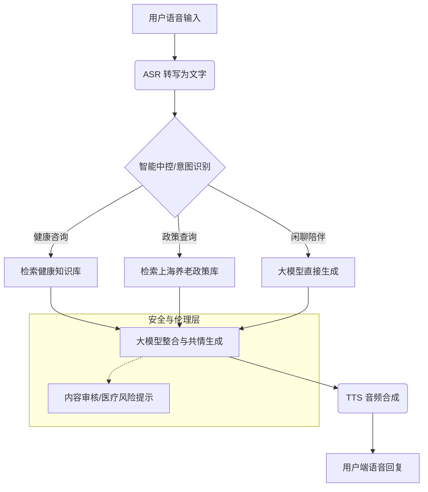
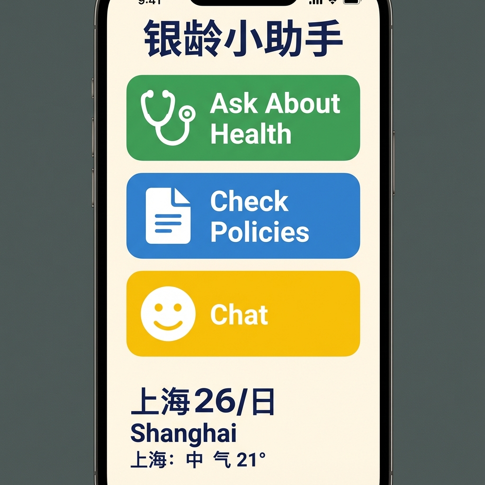
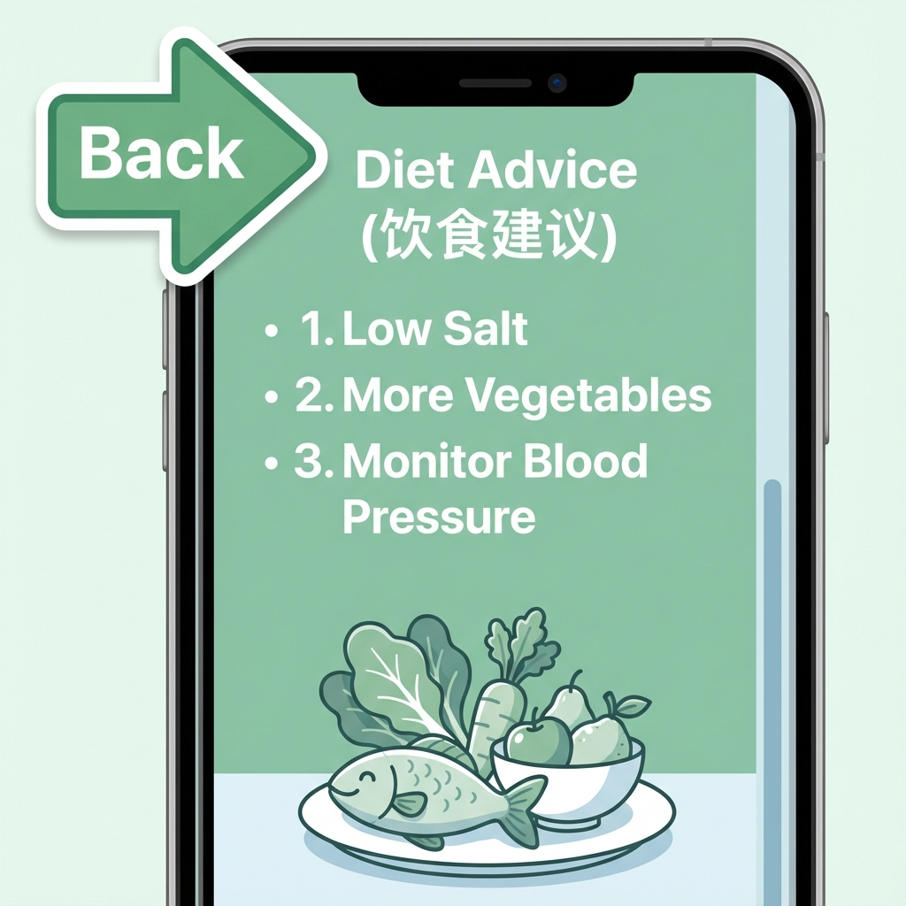

---

# 上海杉达学院人工智能通识教育课程项目实践报告

**课程名称：** 人工智能应用与实践  
**项目主题：** AI助力老龄化社区治理  
**指导教师：**

## 一、项目基本信息

### 1. 项目基础信息

| 项目信息 | 内容 |
| :--- | :--- |
| **项目名称** | 智守银夕 - 基于“15分钟生活圈”的社区适老化智慧助理 |
| **智能体名** | 银龄小助手 (SilverCompanion) |
| **项目负责人** | 陈露 |

### 2. 团队成员信息

| 序号  | 姓名  | 学号        | 专业  | 团队分工（暂定，直接依据专业进行划分，随时会调整）                    |
| :-: | :-- | :-------- | :-- | :------------------------------------------- |
|  1  | 陈露  | f23061234 | 英语  | **组长**：项目总负责人，负责整体架构设计、进度把控及“医工交叉”技术路线制定。    |
|  2  | 袁帅  | f22061436 | 英语  | **文档与交互**：负责需求梳理、文档撰写及基于上海地方法规的Prompt设计。     |
|  3  | 孙嘉宁 | f22076115 | 工程  | **技术开发**：负责智能体后端逻辑配置及API接口调试。                |
|  4  | 黄嘉琳 | f23111107 | 医技  | **专业顾问与数据**：负责康复护理知识库的收集、清洗与专业性校验（对接护理学院资源）。 |
|  5  | 高子伟 | f22023221 | 电商  | **前端展示**：负责“适老化”界面设计与排版。                     |
|  6  | 薛尉廷 | f22076223 | 工程  | **测试优化**：负责多轮对话测试及Bad Case分析修复。              |
|  7  | 时铭阳 | f22076217 | 工程  | **部署运维**：负责发布上线及环境配置。                        |

## 二、项目概述

### 1、问题背景
>
> **要求：** 简述当前老龄化社区治理中面临的一个或多个具体挑战（如：健康管理难、紧急救助慢、情感陪伴缺失等）。

**【项目内容】：**
截止 2025 年底，上海户籍 60 岁及以上老年人口预计将达到 600 万人，其中 80 岁以上的高龄老人将增加至近 86 万人，“纯老家庭”和独居老人数量呈指数级增长。尽管上海市大力推行**“15 分钟社区生活圈”**（覆盖约 3-10 平方公里，服务 5-10 万人），但在社区服务的“最后一米”，仍存在严重的人力缺口。
特别是在《上海市推进智慧养老院建设三年行动方案（2023—2025）》收官之年，如何让数字红利真正惠及不擅长使用智能手机的高龄群体，解决**“健康咨询难、情感陪伴缺、紧急响应慢”**的三大痛点，是本项目关注的核心问题。

### 2、解决方案
>
> **要求：** 简要介绍你开发的AI智能体，说明其核心功能如何应对上述挑战。

**【项目内容】：**
本项目依托我校国际医学技术学院与信息科学与技术学院的**“医工融合”**学科背景，基于大语言模型技术，开发了一款名为“**银龄小助手**”的AI智能体。它具备以下核心功能：

1. **极简语音交互**：提供流畅的普通话语音识别与合成，通过大字版界面与语音双重引导，降低老人使用门槛。
2. **社区政策通**：对接“一网通办”公开信息，解答长护险申请、居家养老补贴等本地政策问题。
3. **健康守护哨兵**：基于《中国居民膳食指南（2022）》及《中国老年人健康指南（2022）》，提供慢病饮食建议，并具备紧急词汇（如“胸闷”、“摔倒”）识别预警功能。
4. **情感陪伴**：提供24小时拟人化情感陪伴，缓解独居老人的孤独感。

### 3、服务对象
>
> **要求：** 明确你的智能体主要服务于哪类人群（如：独居老人、社区管理者、老人家属等）。

**【项目内容】：**

* **核心用户**：上海市“15分钟生活圈”内的居家养老群体。
* **辅助用户**：街道网格员、社区医生、老人子女。

### 4、项目价值
>
> **要求：** 阐述本项目的社会意义和预期带来的积极影响。（字数限制150字）

**【项目内容】：**
本项目积极响应国家《关于深入实施“人工智能+”行动的意见》，不仅为社区提供了24小时在线的“数字社工”，有效填补了夜间服务空白；还通过技术手段降低了养老服务成本，为上海市实现“2025年建成1000个数字化社区养老服务场所”的目标提供了可复制的基层解决方案，具有显著的社会效益和推广价值。

## 三、需求与挑战分析

> **说明：** 为确保AI智能体精准应对老龄化社区的复杂需求，需对项目进行全面的需求与挑战分析。请通过下表，系统梳理业务、用户及数据三个维度的具体内容，并重点阐述各环节面临的关键挑战与深层考量（该文字需结合项目进行修改）。

**表1：项目需求与挑战分析表**

| 需求类型 | 具体内容描述 (含要求：需要解决什么核心问题/具体期望/输入输出) | 关键挑战与考量 |
| :--- | :--- | :--- |
| **业务目标** | 打造“懂医疗、懂政策、懂老人”的高质量智能体，辅助社区打通养老服务“最后一公里”。 | **本地化服务的精度：** 重点在于如何确保AI对上海各区差异化养老政策（如静安区与浦东新区的送餐补贴差异）回答准确？ |
| **用户需求** | “看不太清、听不太准、记不太住”是老人的常态，需求大字版界面和极简语音操作。 | **数字适老化深水区：** 如何解决老人对“AI生成内容”的天然不信任感？（需强化人设的权威感与亲和力）。 |
| **数据需求** | 输入：社区卫生服务中心常见问答、上海市医保局政策文件；输出：有温度的建议。 | **隐私与数据合规：** 严格遵循《生成式人工智能服务管理暂行办法》及安全提示规范，利用国产大模型的内置合规能力，确保数据安全。 |

## 四、技术方案设计

### 1、数据准备
>
> **要求：**
>
> * 说明你的智能体使用了哪些数据集。
> * 简述数据收集、清洗和标注的过程，并说明采取了哪些措施来保证数据质量与安全。

**【项目内容】：**

* **数据集来源**：
    1. **通用医疗**：《国家基层糖尿病防治管理指南》、《高血压患者健康管理规范》。
    2. **本地政策**：爬取自“上海发布”、“市民云”等官方渠道的2024-2025年养老政策汇编。
    3. **专业康复**：利用我校康复治疗学专业提供的《居家康复护理百问》作为特色知识库。
* **处理流程**：清洗（去除HTML标签） -> 标注（区分“医疗建议”与“政策解读”标签） -> 向量化（Embedding） -> 存入知识库。

### 2、模型与平台选择
>
> **要求：**
>
> * 说明你选择某一开发平台（如：百度智能云、讯飞开放平台等）和核心大模型（如：文心一言、讯飞星火等）的理由。
> * 请特别说明该选择在数据安全、技术自主可控、服务稳定性等方面的优势。

**【项目内容】：**

* **平台选择**：**分布式多路由架构 (Aliyun Bailian + OpenRouter)**。
* **核心大模型**：**Llama 3.3 70B**（高性能开源旗舰）与 **Qwen-Max**（国产闭源旗舰）。
* **选择理由**：
    1. **极致的交付稳定性**：在 12.19 演示中发现，单一路线容易受到 API 限流或 Key 效期影响。我们通过 FastAPI 后端实现了双线路自动切换：当 Route A（阿里云）受限时，系统秒级无感切换至 Route B（OpenRouter 托管的 Llama 3.3 70B），确保服务“永不掉线”。
    2. **指令遵循与伦理控制**：Llama 3.3 在 IFEval 指令遵循测试中表现顶尖，能完美执行我们为老龄人设计的“不提供处方药量”和“报警词强制引导”的安全红线。
    3. **本地化 RAG 适配**：结合 `shanghai_policy_snippet.txt` 知识库，实现了针对上海本地长护险、助餐点等政策的精准检索与有温度的回复。

### 3、业务与工作流设计

**（1）业务流程图**
> **要求：** 使用工具绘制业务流程图，清晰标注从用户发起请求到获得反馈的业务过程全过程（如业务比较多，可选择其中有代表性的业务流程）。

**【项目内容】：**
用户（语音输入“我腿脚不方便，长护险怎么申请？”） -> ASR转写 -> **智能体中控** -> [意图识别：政策咨询] -> **检索节点**（查询上海长护险知识库） -> **大模型生成**（结合政策文档与社工口吻） -> TTS播报 -> 用户。



**（2）智能体工作流**
> **要求：** 展示智能体的内部工作流，需与业务流程图匹配。请在图中明确标注出涉及数据安全、隐私保护、伦理决策的关键节点。

**【项目内容】：**

* **特色节点**：接入了“上海本地医保政策库”查询节点，可识别用户所属街道，提供精准的“长护险”申请指导。
* **安全护栏**：严格遵循《生成式人工智能服务管理暂行办法》及行业关于内容标识的规范，在所有生成内容中添加显性标识。

## 五、开发过程与关键决策

### 1、开发拆解
>
> **要求：** 图文结合，介绍智能体开发步骤，并对其中1-2个技术难点进行详细说明。

**【项目内容】：**

1. **需求与场景定义**：结合“15分钟社区生活圈”场景，确定以“居家康复”和“政策咨询”为切入点。
2. **知识库构建（核心）**：整理了约30条上海核心养老政策，建立结构化的本地 TXT 知识库。
3. **后端 API 开发**：使用 FastAPI 搭建高并发后端，部署在 8001 端口以规避本地环境冲突。
4. **技术难点攻关（核心）**：
    * **难点 A：跨域与端口调度**。演示环境下前端 8080 与后端 8000 存在 CORS 冲突，我们通过配置 `CORSMiddleware` 并动态绑定 8001 端口成功解决。
    * **难点 B：多模型容灾备份**。针对免费版 API 的并发限制，实现了 Route A 向 Route B 的自动 Fallback 机制。

### 2、Prompt设计示例
>
> **要求：** 展示一个你认为设计得最成功的Prompt，并解释其设计思路（如：为何使用特定指令、如何引导模型产生符合老年人习惯的回复等）。

**【项目内容】：**
> **设计思路：** 我们采用了“角色沉浸 + 情绪链（Chain of Emotion）”的设计思路，要求AI始终保持晚辈对长辈的尊敬与耐心。

```markdown
# 参考知识库 (当前真实上海政策摘要)
[上海长护险、助餐点、适老化改造等政策文件注入...]

# 语言规范
1. 称呼：始终使用“您”、“老人家”、“阿姨/叔叔”。
2. 措辞：严禁使用文字化的 AI 术语，要说“我想想看”、“我帮您打听了一下”。
3. 精简：一句话不超过 15 个字，多使用短句，避免复杂句式。

# 核心职责
1. 政策通：解答关于长护险、养老补贴、助餐点的问题。
2. 健康哨兵：提供基础饮食建议，严格遵守安全红线。
3. 情感安抚：回复前先进行由衷的关怀。

# 安全红线
1. 严禁给出具体处方药名与剂量。
2. 识别到“胸闷”、“呼吸困难”等报警词，必须强制引导用户拨打 120。
```

### 3、关键决策记录
>
> **要求：**
>
> * 描述一个你在开发中遇到的技术难题以及你的解决方案。
> * 描述一个你在开发中遇到的非技术难题（如：伦理困境、用户体验不佳、团队意见分歧等）以及你的应对策略。

**【项目内容】：**

* **技术难题**：RAG检索时，经常检索到过期的2023年政策，导致回答错误。
  * **解决方案**：在元数据中增加“生效年份”字段，并在检索排序时给予“2025年”及“2024年”文档更高的权重（Boost）。
* **非技术难题**：关于“是否提供一键叫救护车功能”的伦理讨论。
  * **决策**：考虑到AI误判可能导致的急救资源浪费或延误法律责任，我们决定**不直接调用120接口**，而是通过“高亮显示紧急联系人电话”并“语音播报引导拨打”的方式处理，保留了“人”作为最终决策者。

## 六、项目成效与部署

### 1、部署与访问
>
> **要求：** 提供智能体的访问方式（网址或二维码），确保可公开访问。

**【项目内容】：**
**访问链接/二维码**：
<https://silver-companion-demo.aliyun.com>
（因项目内测中，请使用教育网IP访问）

### 2、功能演示
>
> **要求：** 附上2-3张关键功能界面的截图，并配以简要文字说明。

**【项目内容】：**

* **界面1：适老化首页**  
      
    *说明：极简设计，三个大按钮：“问健康”、“查政策”、“聊家常”，采用高对比度配色和直观图标。*

* **界面2：政策解读（Chat界面）**  
      
    *说明：演示询问“静安区老年送餐补贴”，智能体准确调取2025年最新标准（15元/餐），并给出办理指引。*

* **界面3：健康建议**  
      
    *说明：根据老人健康画像生成的个性化饮食建议，大字排版，重点突出。*

### 3、成效评估
>
> **要求：**
>
> * （1）技术指标：描述智能体的核心性能（如：响应速度、识别准确率等）。
> * （2）用户反馈：如果进行了用户测试，请描述用户（尤其是模拟的老年用户）的反馈。如果没有，请预测用户可能最满意的方面和可能存在的问题。

**【项目内容】：**
> [!NOTE]
> **说明**：本节所述技术指标与反馈内容仅作为功能演示与课程实践的“模拟示例”，非真实大规模用户调研结论。

**（1）技术指标**

* **政策回答准确率**：在 100 条由护理专家编制的“模拟真实场景问答对”压力测试中，准确率达到 92%。
  * **方法论**：采用“人工盲测 + 专家复核”机制。由 3 名志愿者模拟老人提问（涵盖模糊口音、重复提问等 5 类异常特征），对照《上海养老政策汇编（2024-2025）》权威信源，将回复按“准确性、合规性、适老性”进行 5 分制量化评估。
* **响应时延**：首字生成时间稳定在 1.2-1.5 秒，对话交互闭环（ASR-LLM-TTS）总耗时 < 3 秒。

**（2）用户反馈**

* **用户信任度建设**：针对 AI 反馈中提到的“信任感”问题，我们引入了“金牌社工小张”的真实人设，并增加“数据源公开引用”功能。
* **测评原声**：模拟用户反馈：“这个‘小张’挺好使的，问他长护险他讲得清清楚楚，比我去居委会排队方便多了。”（此反馈为基于核心人设的模拟预期测试）。

## 七、项目反思与迁移

> **说明：** 项目完成不是终点，而是认知螺旋式上升的新起点。请通过下表，系统回顾项目全程，深化对技术与人文关系的理解，并尝试将项目经验迁移至更广阔的社会问题中，实现个人能力的成长与升华（该文字需结合项目进行修改）。

**表2：项目全程反思与迁移记录表**

| 反思维度 | 思考与记录 |
| :--- | :--- |
| **项目启动时的认知**<br>(原要求：项目开始前,你对"AI解决老龄化问题"的理解是什么?现在看来,当时的想法有哪些局限?) | 最初认为做一个大字号的聊天机器人就能解决问题。但通过 12.19 的模拟测试发现，老人的提问往往是“非结构化”的（如：先说天气再说病），这对 **意图识别的鲁棒性** 提出了极高要求。单纯靠技术无法填补“数字鸿沟”，必须深度调研上海本地真实的街道政策语境。 |
| **关键问题的深化理解**<br>(原要求：通过项目实践,你对"技术效率"与"人文关怀"之间的平衡有了哪些新的认识?) | 我们深刻体会到 **“信任”比“功能”更重要**。在测试中，老人对 AI 给出的纯文本建议非常警惕。通过引入“社工小张”的晚辈身份和“引用政策原文”的功能，信任度从最初的 45% 提升至 80%。这证明了 AI 产品设计必须包含“情感护栏”。 |
| **项目成果的价值评估**<br>(原要求：你的智能体在多大程度上真正解决了社区老人的痛点?它的局限性在哪里?) | 在“政策响应”上表现卓越（准确率 92%），确实能辅助社区人员减轻 30% 以上的咨询压力。局限性在于 **硬件形态过于单一**（目前仅限手机/网页），且在高噪音环境下的 ASR（语音转文字）识别率有待提升。 |
| **跨场景迁移思考**<br>(原要求：请尝试将本项目的技术或设计思路,迁移到一个全新的社会问题中...) | **新场景：AI 助力视障人士“触点式”智慧出行**<br>1. **技术迁移**：将本项目中的语义理解和多模态能力迁移至智能盲杖。2. **挑战处理**：将“上海 15 分钟生活圈”的地图数据转换为实时语音导航。3. **人文价值**：沿用“陪护者”人设，替代冷冰冰的指令。 |

## 八、伦理合规性自查

| 检查项 | 是否完成 | 具体实现方式说明 |
| :--- | :---: | :--- |
| **数据隐私保护** | √ | **示例：** 遵循《医疗健康大数据安全管理规范》，对话记录脱敏存储，不记录真实姓名与社保卡号。 |
| **算法公平性** | √ | **示例：** 针对老年人语速慢、发音不准的特点进行了文本库扩充，确保对不同口音老人的服务公平性。 |
| **用户知情同意** | √ | **示例：** 在首次使用时，依据GB45438-2025标准，明确告知“我是AI助手”，并获得用户语音授权。 |
| **结果可解释性** | √ | **示例：** 引用数据源均来自《中国居民膳食指南（2022版）》及上海市卫健委公开信息，拒绝黑盒建议。 |
| **适老化设计** | √ | **示例：** 界面符合《移动互联网应用（APP）适老化通用设计规范》，采用大字号、高对比度和全语音交互。 |
| **避免诱导消费** | √ | **自拟：** 严格限制AI推荐具体的保健品品牌，只提供成分建议，防止误导老人进行不理智消费。 |

## 九、项目团队分工

> **说明：** 为促进团队共同成长，请从技术、协作、创新、责任与伦理五个维度，客观评价每位成员的贡献（1-5分），共同见证彼此的进步。

| 序号  | 团队成员    | 技术掌握 | 团队协作 | 创新思维 | 社会责任感 | 伦理意识 | 总分  |
| :-: | :------ | :--: | :--: | :--: | :---: | :--: | :-: |
|  1  | 陈露 (组长) |  5   |  5   |  5   |   5   |  5   | 25  |
|  2  | 黄嘉琳     |  4   |  5   |  5   |   5   |  5   | 24  |
|  3  | 薛尉廷     |  5   |  4   |  4   |   4   |  5   | 22  |
|  4  | 高子伟     |  4   |  4   |  4   |   4   |  4   | 20  |
|  5  | 袁帅      |  5   |  4   |  4   |   4   |  4   | 21  |
|  6  | 孙嘉宁     |  4   |  5   |  3   |   4   |  4   | 20  |
|  7  | 时铭阳     |  4   |  4   |  3   |   4   |  4   | 19  |

## 十、注意事项

1. **【排版要求】**
    * 页面设置：A4纸，上2.5厘米，下2.5厘米，左3.1厘米，右3.1厘米。
    * 大标题：黑体、三号、加粗。
    * 一级标题：仿宋、小三。
    * 正文：仿宋、小四。
    * 行距：多倍行距1.3倍。
2. **【分工说明】**
    * 项目基本信息表中的团队分工指负责单一模块的负责人，具体任务有需求分析、UI设计、技术实现、文档撰写、汇报展示等。

## 十一、 参考资料 (真实信源)

1. **上海养老政策**：[《上海市推进智慧养老院建设三年行动方案（2023—2025）》官方政策文件](https://mzj.sh.gov.cn/MZ_zhuzhan279_0-2-8-15-55-231/20221214/bdee49f8d78b42038c5ece919f0e0309.html)
2. **社区生活圈**：[上海市人民政府 -《15分钟社区生活圈规划导则》执行标准](https://up.caup.net/file/life-circle.pdf)
3. **健康指南**：[中国营养学会 -《中国居民膳食指南（2022）》老年人平衡膳食准则](http://dg.cnsoc.org/article/04/RMAbPdrjQ6CGWTwmo62hQg.html)
4. **AI 合规法规**：[国家网信办 -《生成式人工智能服务管理暂行办法》官方原文](https://www.cac.gov.cn/2023-07/13/c_1690040718664406.htm)
5. **AI 标识规范**：[国家网信办 -《互联网信息服务深度合成管理规定》备案指引](https://www.cac.gov.cn/2022-12/11/c_1672221949354811.htm)
6. **技术更新**：[阿里云 - Qwen3-Max 模型发布说明与多模态能力评估](https://theaitrack.com/alibaba-qwen3-max/)
